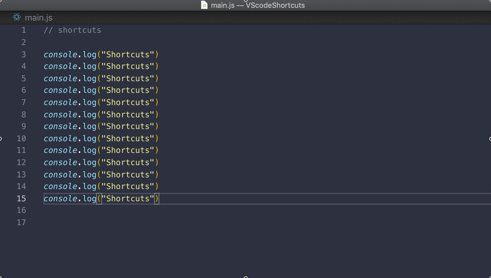
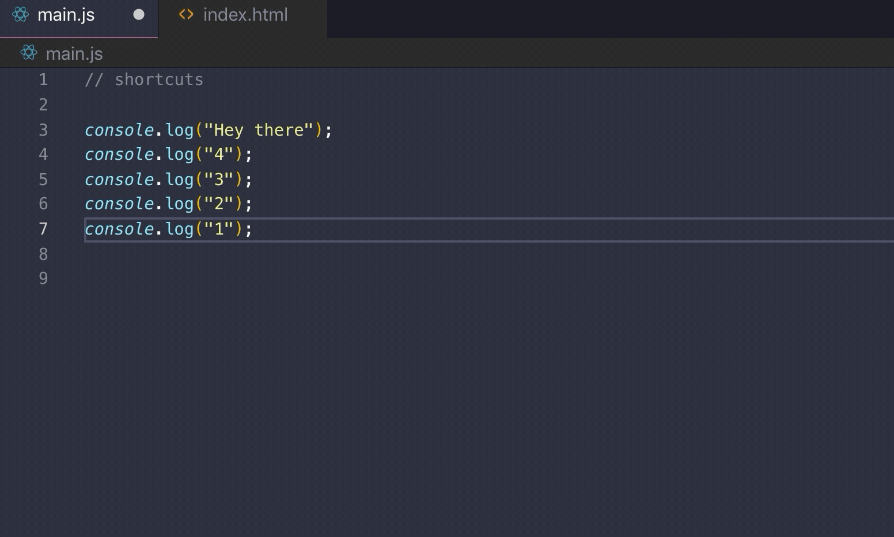
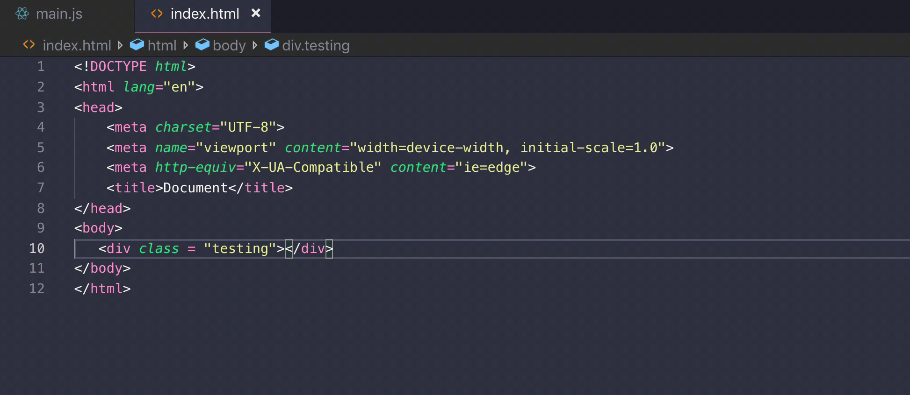
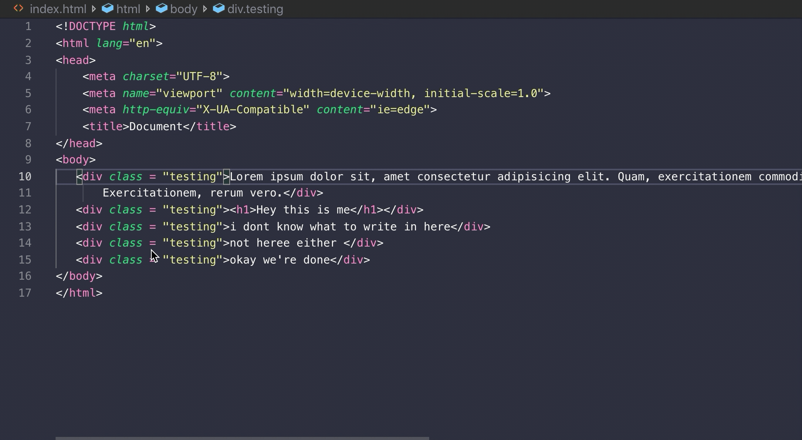

# VScodeMagic

## In this repo i will try to cover some of the amazing shortcuts that VScode provides in order to make our coding lives easier.

### How to multi comment? 
* MAC : CMD + /
* Windows : Ctrl + /

### Move a line or multiple lines without copying and pasting
* MAC : opt + arrow Up/Down
* Windows : alt + arrow Up/Down

### Clone a line
* MAC : shift + opt + arrow Up/Down
* Windows : shift + alt + arrow Up/Down

### Have controle on of multiple lines
* MAC : opt + Leftclick
* Windows : alt + Leftclick

